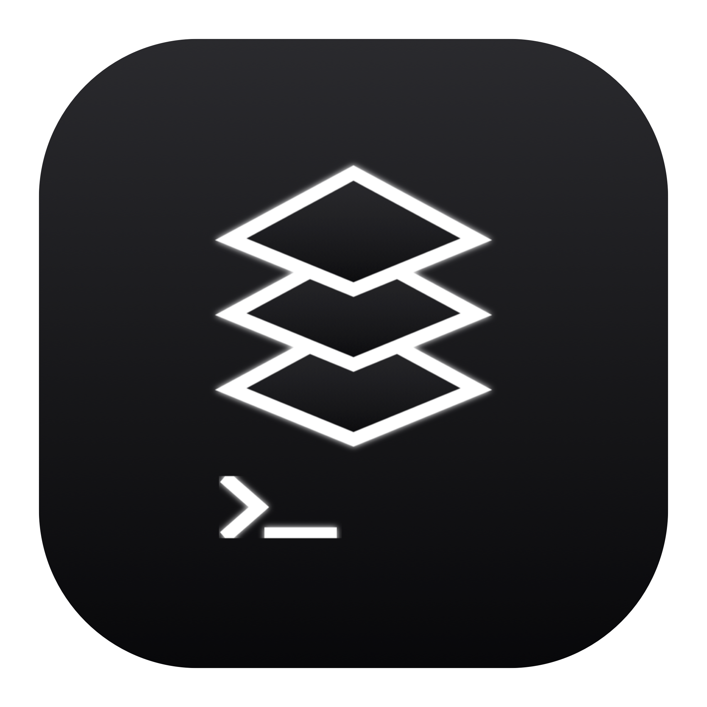

<p align="center">
  
</p>

<h1 align="center">Stratos</h1>

<p align="center"><strong>An open-source framework for building agent-powered IDEs.</strong></p>

<p align="center">
  <a href="https://github.com/ContextSphere/stratos/actions/workflows/ci.yml"></a>
  <a href="https://github.com/ContextSphere/stratos/releases/latest"></a>
  <a href="https://www.npmjs.com/package/@stratosapp/core"></a>
  <a href="https://www.npmjs.com/package/@stratosapp/ui"></a>
  <a href="./LICENSE"></a>
</p>

Stratos gives you everything you need to create a personalized, visual interface for managing AI agents — for yourself, your team, or your product. Whether you live in a terminal or have never opened one, Stratos makes working with agents seamless.

It ships with a fully functional desktop app out of the box, and its modular architecture means you can extend, embed, or rebuild any layer. Stratos is also fully vibe-codable — it can build new features for itself. An app that builds itself.

**Supported providers:** Claude Code, Codex. More coming (OpenCode, etc.).

---

## Why Stratos

AI agents are powerful, but the interfaces around them are either locked inside terminals or locked inside someone else's product. Stratos takes a different approach:

- **For everyone, not just developers.** A clean, intuitive interface that makes AI agents accessible to anyone who wants to get work done.
- **Framework, not just an app.** A layered architecture with a provider-agnostic core, a portable React UI, and a reference desktop shell. Use the pieces you need.
- **Multi-agent, multi-provider.** Run Claude Code and Codex side by side. Switch providers without rewriting your UI.
- **Full visibility.** Watch tool calls, file changes, diffs, and reasoning in real time. Approve, plan, or let agents run autonomously.
- **An app that builds itself.** Stratos includes full harness engineering support — use one instance to vibe-code new features into another. Anyone can customize their own experience.

---

## Architecture

Stratos is a monorepo with three packages. Each layer has strict boundaries so you can use them independently.

```
┌─────────────────────────────────────────────┐
│  @stratosapp/ui                             │
│  React components · hooks · bridge system   │
│  Zero Electron dependency — works anywhere  │
├─────────────────────────────────────────────┤
│  @stratosapp/core                           │
│  Provider abstraction · storage · traces    │
│  Pure TypeScript — no React, no DOM         │
├─────────────────────────────────────────────┤
│  @stratosapp/desktop                        │
│  Electron shell · IPC bridge · packaging    │
└─────────────────────────────────────────────┘
```

| Package                   | What it does                                               | Use it to...                                                 |
| ------------------------- | ---------------------------------------------------------- | ------------------------------------------------------------ |
| **`@stratosapp/ui`**      | Chat view, file explorer, diff viewer, permission controls | Embed agent UI in any React app (web, Next.js, etc.)         |
| **`@stratosapp/core`**    | Provider interface, storage adapters, trace store          | Add new agent providers, build headless agent tooling        |
| **`@stratosapp/desktop`** | Electron app wiring core + UI via IPC bridge               | Run the full desktop experience, or fork as a starting point |

---

## Get Started

### Use the app

Download the [latest macOS .dmg](https://github.com/ContextSphere/stratos/releases/latest) or build from source:

```bash
pnpm install
pnpm build
pnpm --filter @stratosapp/desktop dev
```

### Build on it

```bash
# Use the UI layer in your own React app
pnpm add @stratosapp/ui

# Use the core layer for headless agent orchestration
pnpm add @stratosapp/core
```

### Prerequisites

- Node.js 22+
- pnpm 9+

---

## Features


- Multi-thread agent sessions with folder organization
- Real-time streaming of tokens, tool calls, reasoning, and file changes
- Integrated file explorer and diff preview
- Cost and token tracking per session
- Worktree isolation for parallel development
- Provider-agnostic — swap agents without changing UI code

---

## Roadmap

- **More providers** — OpenCode support and a plugin interface for third-party agents
- **Multi-agent orchestration** — coordinate multiple agents across tasks
- **Extension surface** — let the community build and share integrations
- **Cross-platform** — Windows and Linux desktop builds

---

## AI-Native Development

Most of Stratos was built and tested using Claude Code. The codebase isn't just agent-friendly — it's engineered for it.

The repo ships with full [harness engineering](./docs/harness-engineering.md): `CLAUDE.md` defines architecture constraints and layer boundaries, skills provide reusable agent workflows, and MCP configs wire up tools like Chrome DevTools so agents can visually verify their own UI changes. Stratos can even launch a second instance of itself in a worktree, letting an agent build a feature, screenshot the result, and iterate — without human intervention. An agent can clone this repo, understand the architecture, build a feature, and test it — end to end.

That said, AI-native does not mean AI-sloppy. We care deeply about clean architecture, clear boundaries, and long-term maintainability. If an agent produces code that doesn't meet the bar, it gets the same scrutiny as any other PR.

The goal: anyone should be able to point an agent at this repo and build something meaningful on top of it.

---

## Contributors

<table>
  <tr>
    <td align="center">
      <a href="https://github.com/talktoajayprakash"></a><br />
      <strong>Ajay Prakash</strong><br />
      <a href="https://github.com/talktoajayprakash">GitHub</a> · <a href="https://www.linkedin.com/in/ajay-prakash-3780b132/">LinkedIn</a>
    </td>
    <td align="center">
      <a href="https://github.com/nikhilesh-payyavuala"></a><br />
      <strong>Nikhilesh Payyavuala</strong><br />
      <a href="https://github.com/nikhilesh-payyavuala">GitHub</a> · <a href="https://www.linkedin.com/in/npayyavu/">LinkedIn</a> · <a href="https://x.com/npayyavuala">X</a>
    </td>
  </tr>
</table>

---

## Contributing

We welcome contributions. Open an issue to discuss scope, then send a focused PR.

See [CONTRIBUTING.md](./CONTRIBUTING.md) for details.

---

## License

Apache-2.0. See [LICENSE](./LICENSE).
